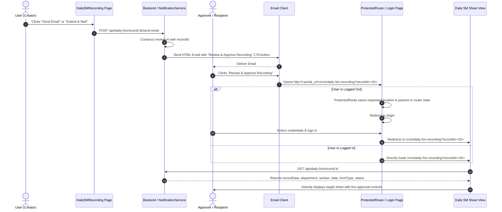

# Implementation Plan: Daily 5M Email Deep-Linking & Direct Sheet Opening Through Login

## 1. Overview & Objective
When a user sends an email or submits a **Daily 5M Recording Sheet**, the recipient receives an email notification containing a **"Review & Approve Recording"** action button.

- When the recipient clicks this button from their email, they are directed to the LMS portal.
- **Unauthenticated Flow**: If the user is currently logged out, they are directed to the **Login Page** with the target URL preserved. Immediately upon successful authentication, they are redirected straight to the specific Daily 5M sheet.
- **Authenticated Flow**: If the user is already logged in, the target sheet opens directly without showing the record selection table.

---

## 2. End-to-End Workflow & Architecture



---

## 3. Step-by-Step Implementation Breakdown

### Step 1: Email Generation & Deep Link Construction
- **File**: `server/services/notification.service.js`
- **Method**: `sendFormReport(formName, departmentId, formData)`
- **Behavior**:
  - When `formName === "Daily 5M Recording Sheet"`, the service reads `ENV.ADMIN_URL` (or falls back to configured network host).
  - Constructs the review deep-link:
    ```javascript
    const adminUrl = ENV.ADMIN_URL || "http://192.168.90.19:5174";
    const reviewUrl = `${adminUrl}/cms/daily-5m-recording?recordId=${formData.recordId}`;
    ```
  - Embeds the link inside an HTML email template as a prominent call-to-action button:
    ```html
    <div style="margin: 25px 0;">
        <a href="${reviewUrl}"
           style="background-color: #007bff; color: white; padding: 12px 24px; text-decoration: none; border-radius: 5px; font-weight: bold; display: inline-block;">
            Review & Approve Recording
        </a>
    </div>
    ```

---

### Step 2: Route Protection & State Preservation
- **Files**: `admin/src/components/ProtectedRoute.jsx` & `admin/src/App.jsx`
- **Behavior**:
  - The route `/cms/daily-5m-recording` is protected by `<ProtectedRoute>` and `<RequireAccess allow="daily5m:read">`.
  - When an unauthenticated user arrives at `/cms/daily-5m-recording?recordId=<RECORD_ID>`, `ProtectedRoute` captures the full location object (including `pathname` and `search` query string).
  - Redirects the user to `/login` with the location preserved in navigation state:
    ```jsx
    if (!isLoggedIn || !user) {
        return <Navigate to="/login" state={{ from: location }} replace />;
    }
    ```

---

### Step 3: Post-Login Redirection Handling
- **File**: `admin/src/pages/Login.jsx`
- **Behavior**:
  - In `Login.jsx`, the authentication effect checks `location.state?.from`:
    ```javascript
    const from = location.state?.from;
    let targetPath = (from && from.pathname && from.pathname !== '/login')
      ? (from.pathname + (from.search || ""))
      : null;
    ```
  - When present, the post-login redirection bypasses the default landing/dashboard page and navigates immediately to `targetPath` (`/cms/daily-5m-recording?recordId=<RECORD_ID>`).

---

### Step 4: Sheet Hydration & Direct Opening
- **File**: `admin/src/pages/CMS/Daily5MRecording.jsx`
- **Behavior**:
  1. **Query Parameter Extraction**:
     ```javascript
     const [searchParams] = useSearchParams();
     const urlRecordId = searchParams.get('recordId');
     ```
  2. **Automated Record Fetching**:
     ```javascript
     useEffect(() => {
         if (urlRecordId) {
             fetchRecordById(urlRecordId).then(() => {
                 setShowFormList(false); // Bypasses table listing, opens sheet view directly
             });
         }
     }, [urlRecordId]);
     ```
  3. **State Population in `fetchRecordById`**:
     - Calls backend `GET /api/daily-5m/record/:id`.
     - Populates `selectedDepartment`, `selectedSection`, `selectedDate`, `formData`, `formType`, `sessionId`, `recordStatus`, and `savedRevisionInfo`.
     - Calculates `rowCount` dynamically based on filled rows.
  4. **Cascade Protection**:
     - Department change effects check `!urlRecordId` to avoid resetting `selectedSection` on direct URL loads.
  5. **Approver Controls**:
     - Determines `canApprove` based on segregation of duties (`isSubmitter`) and cross-department approval routing (`canActOnRowShared`).
     - Renders row-level Approve/Reject action buttons for authorized approvers.

---

## 4. Key Files & Components

| Component | File Path | Responsibility |
| :--- | :--- | :--- |
| **Email Template & Link** | `server/services/notification.service.js` | Generates deep link URL and builds HTML email with CTA button |
| **Email Trigger Controller** | `server/controllers/daily5MRecord.controller.js` | Receives send-email request and invokes notification service |
| **Email Route** | `server/routes/daily5M.routes.js` | Exposes `POST /api/daily-5m/record/:id/send-email` |
| **Protected Route Handler** | `admin/src/components/ProtectedRoute.jsx` | Intercepts unauthenticated deep link visits and stores `state.from` |
| **Login Component** | `admin/src/pages/Login.jsx` | Authenticates user and redirects to preserved `state.from` path + query params |
| **App Routing** | `admin/src/App.jsx` | Configures `/cms/daily-5m-recording` route under `<CmsLayout />` |
| **Daily 5M Sheet View** | `admin/src/pages/CMS/Daily5MRecording.jsx` | Parses `urlRecordId`, loads record data, and opens sheet directly |

---

## 5. Verification Checklist

1. **Email Sending Test**:
   - Create or save a Daily 5M session in `Daily5MRecording.jsx`.
   - Click "Send Email" or "Submit & Mail".
   - Confirm email arrives with the "Review & Approve Recording" button containing the link `.../cms/daily-5m-recording?recordId=<id>`.

2. **Logged-Out Flow Test**:
   - Log out of the LMS or open an Incognito window.
   - Click the "Review & Approve Recording" link from the email.
   - Verify redirection to `/login`.
   - Enter credentials and submit login.
   - Verify immediate redirection to the exact Daily 5M sheet (record list table is bypassed).

3. **Logged-In Flow Test**:
   - With an active login session in the browser, click the link from the email.
   - Verify the sheet loads directly with all rows, date, shift, department, and section pre-filled.

4. **Approval Action Test**:
   - Ensure an approver (who is not the submitter and has approval rights) can view the Approve/Reject buttons and take action.
